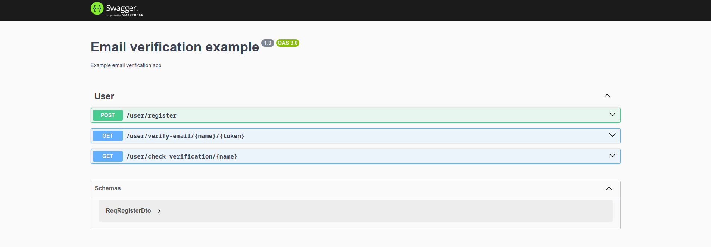

# NestJS Email Doğrulama Uygulaması

Uygulama SQLite veritabanını kullanmaktadır. ORM olarak TypeORM seçilmiştir.

Uygulama environment değişkenleri için doğrulama yapmaktadır, gerekli değişkenler tanımlanmadığı zaman uygulama hangi değişkenlerin eksik olduğunu bildirip hata verecektir, doğrulama için Joi paketi kullanılmıştır.

DTO'lar da doğrulanmaktadır. Geçersiz bir JSON isteği gönderildiği zaman uygulama gerekli bilgiyle birlikte hata mesajı verecektir, DTO doğrulaması için class-validator paketi kullanılmıştır.

SMTP sağlayıcısıyla iletişim için nodemailer paketi kullanılmıştır.

API dokümantasyonu ve TypeScript dokümantasyonu İngilizce dili ile yazılmıştır.

Doğrulama e-postası için ChatGPT'den yararlanılarak bir Handlebars Template'i oluşturulmuştur.

## ChatGPT Kullanımı

ChatGPT uygulamanın geliştirme aşamasında sadece email template hazırlaması için kullanılmıştır.
Log aşağıdaki linkten ulaşılabilir.

[Gist Linki ](https://gist.github.com/keskinemirhan/ea8170bbfaf6f6ec34308924abe1a1b6)

## Çalıştırma ve Test Etme

Uygulamanın test tarafında UserService için bir unit test ve bir de tüm endpointleri test etmek için e2e test yazılmıştır.
Testlerde SQLite geçici veritabanı kullanılmaktadır (:memory:).

### Çalıştırma

Uygulamayı çalıştırmak için aşağıdaki komutları girmek yeterli olacaktır.

```sh
$ git clone git@github.com:keskinemirhan/b-ornek.git
$ cd b-ornek
$ npm install
$ npm run start

```

### Test Etme

```sh
$ git clone git@github.com:keskinemirhan/b-ornek.git
$ cd b-ornek
$ npm install
$ npm run test
$ npm run test:e2e
```

## API Dokümantasyonu

Uygulamanın API dokümantasyonuna uygulamayı çalıştırdıktan sonra "-server-url-/api" kısmından ulaşılabilir. Swagger kullanılarak hazırlanmıştır.


## Gerekli Environment Değişkenleri

Gerekli değişkenler aşağıdaki gibidir. Tüm değişkenlerin girilmesi önerilir. Değişkenlerin nasıl doğrulandığını env.validation.ts dosyasında bulabilirsiniz.

```
CONSOLE_MAIL = false
SMTP_HOST = <smtp-host>
SMTP_PORT = <smtp-port>
SMTP_TLS = <smtp-tls>
SMTP_USERNAME = <smtp-username>
SMTP_PASSWORD = <smtp-password>
MAIL_SENDER = company@mail.com
APP_HOST = 127.0.0.1
APP_PORT = 1234
APP_URL = localhost:1234
```

- CONSOLE_MAIL - Eğer SMTP sağlayıcısı kullanmak istemiyorsanız bu değişkene true değerini verebilirsiniz ancak SMTP değişkenleri zorunlu olduğu için rastgele değerler girmelisiniz.
- SMTP_HOST - SMTP sağlayıcısının host adresi.
- SMTP_PORT - SMTP sağlayıcısının portu.
- SMTP_TLS - Eğer SMTP sağlayıcısıyla TLS kullanarak bağlantı kurulacaksa true verilmelidir aksi halde boş bırakılabilir.
- SMTP_USERNAME - SMTP kullanıcı adı.
- SMTP_PASSWORD - SMTP şifresi
- MAIL_SENDER - Doğrulama e-postasını gönderen e-posta adresi.
- APP_HOST - Uygulama host adresi (ip adresi)
- APP_PORT - Uygulamanın çalışacağı port.
- APP_URL - Uygulamanın herkese açık URL adresi.
